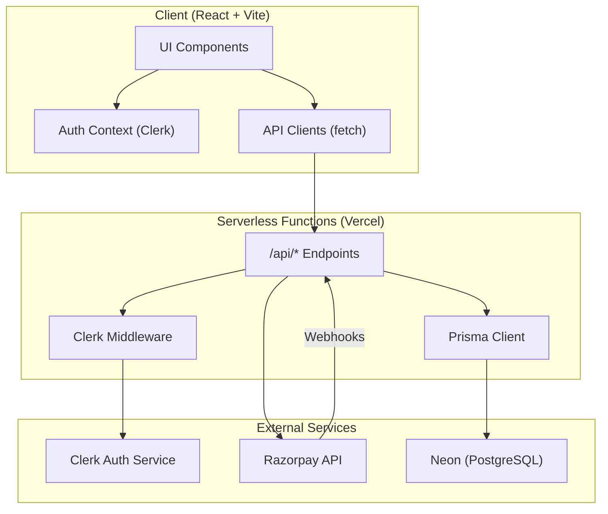
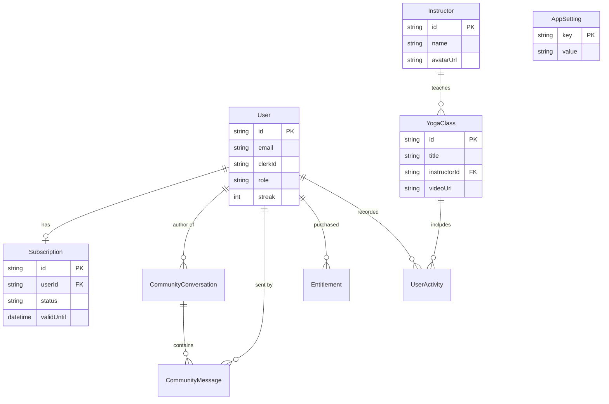

# YogaFlow Architecture Documentation

Welcome to the documentation for the YogaFlow architecture. This document provides a high-level overview of the system's components, data model, and workflows.

## System Overview

YogaFlow is a modern yoga platform designed to provide a seamless experience for yoga practitioners and instructors. It features class management, community interactions, subscription-based access, and an administrative dashboard for managing content and users.

---

## Technology Stack

The application is built using a modern, scalable architecture:

- **Frontend**: React (Vite) for the user interface, styled with Vanilla CSS and Tailwind-like utility patterns.
- **Backend**: Vercel Serverless Functions for API endpoints.
- **Database**: Neon (PostgreSQL) managed through Prisma ORM.
- **Authentication**: Clerk for secure user identity management.
- **Payments**: Razorpay for subscription billing and one-time payments.
- **Media**: Vercel Blob or external URLs for images and videos.

---

## High-Level Architecture

The diagram below shows how the Client, API, and Database interact with third-party services.



---

## Data Model (Prisma ER Diagram)

The following diagram illustrates the database schema and relationships.



---

## Key Workflows

### Authentication Flow
1.  **Sign-In**: The user authenticates via the Clerk UI in the frontend.
2.  **JWT Verification**: The frontend sends a Clerk JWT to the `/api/*` endpoints.
3.  **Middleware**: The serverless functions verify the JWT using Clerk's backend SDK.
4.  **Database Sync**: On the first login, a webhook or manual sync creates a corresponding `User` record in the Neon database.

### Subscription & Payments
1.  **Checkout**: The user selects a plan in the `Pricing` component.
2.  **Razorpay Order**: A serverless function creates a Razorpay order/subscription.
3.  **Payment Processing**: The user completes the payment through the Razorpay SDK.
4.  **Webhook Notification**: Razorpay sends a signed webhook to `/api/webhooks/razorpay`.
5.  **Database Update**: The webhook handler updates the `Subscription` and `User` status in the database.

---

## Directory Structure

```text
/
├── api/                # Serverless API functions (Prisma, Clerk, Razorpay)
├── components/         # React UI components (Admin, Dashboard, Landing)
├── config/             # Shared configuration and constants
├── contexts/           # React Contexts (Auth, State)
├── prisma/             # Database schema and migrations
├── utils/              # Helper functions (API clients, formatting)
└── types.ts            # Shared TypeScript interfaces
```

---

## Deployment strategy

YogaFlow is optimized for deployment on **Vercel**:
- Frontend assets are cached at the Edge.
- API endpoints run as Serverless Functions.
- The Neon database provides a serverless PostgreSQL experience with minimal cold-start impact.
